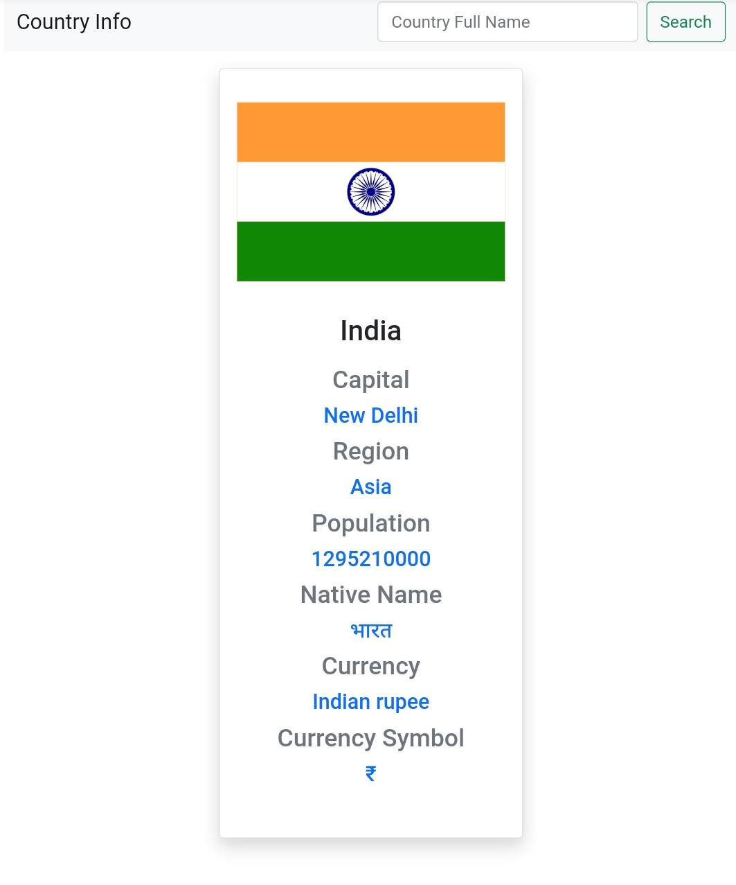

## Country Info 
> This is a simple API based project in which you will get Information about any Country.

> what I did not like aboout this API is you musthave entered the full name of any country.

> For Ex - You will not get any info about "Syria", you must use its official name which is "Syrian Arab Republic"

> However you can use shortcode like "USA" for United States of America,"UAE" for United Arab Emirates

`Here is a look of website`

